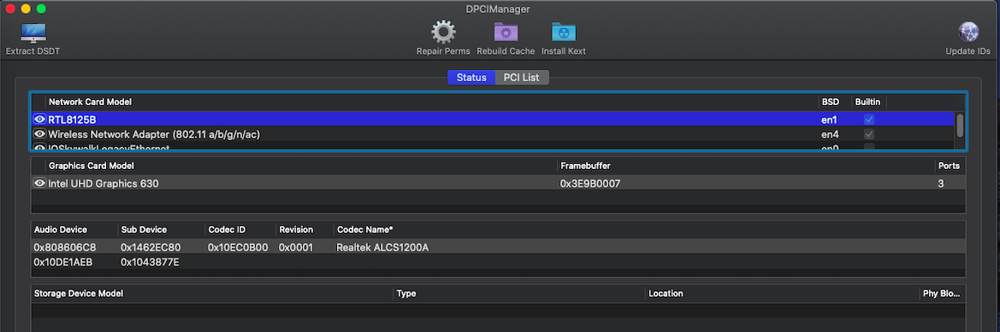
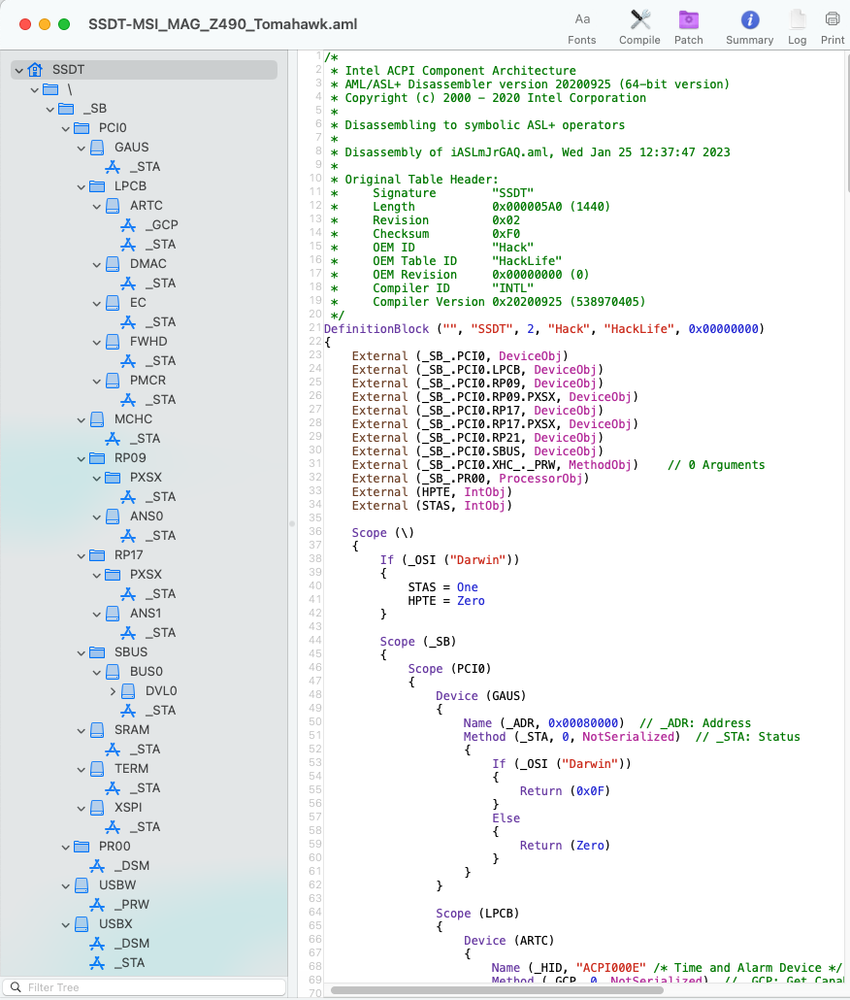

### Computer Spec:
| Component        | Brank                                    |
| ---------------- | ---------------------------------------- |
| Scheda Madre     | MSI MAG Z490 Tomahawk                    | 
| CPU              | Intel I7 10700                           | 
| IGPU             | Intel® UHD Graphics 630                  |
| GPU              | Asus Phoenix Geforce GTX 1660 (Disable)  |
| Audio            | Realtek ALC1200A                         |
| Ram              | 16 Gb DDR4 3000 Mhz                      |
| Wifi + Bluetooth | MQUPIN AC1750 (BCM94360CD)               |
| NVMe             | Corsair Force MP510                      |
| SmBios           | IMac 20.1                                |
| BootLoader       | OpenCore                                 |

https://www.msi.com/Motherboard/MAG-Z490-TOMAHAWK##

## DCPIManager Screenshot

### What works and What doesn't or WIP:
- [x] Intel UHD 630 iGPU
- [x] ALC1200A Internal Speakers
- [x] ALC1200A HDMI Audio Output
- [x] All USB Ports 
- [x] Wi-Fi and Bluetooth
- [x] Intel (11)I219-V LAN
- [x] RTL8125 Ethernet
- [x] NVRAM
- [x] Windows boot from OpenCore

## USB Map by Hackintool
- Usb port mapping performed

- Cosmetics DSM in Configplist

## Info Section SSDT MSI MAG Z490 Tomahawk UHD630

## Credits
- [Acidanthera](https://github.com/acidanthera) for OpenCore and all the lovely hackintosh work.
- [Apple](https://apple.com) for macOS;
- [daliansky](https://github.com/daliansky)
- [Dortania](https://github.com/dortania)
- [Hackintoshlifeit](https://github.com/Hackintoshlifeit)
- [rehabman](https://github.com/RehabMan)

# If you need help please contact us on [Telegram](https://t.me/HackintoshLife_it) or [Web](https://www.hackintoshlife.it/)
